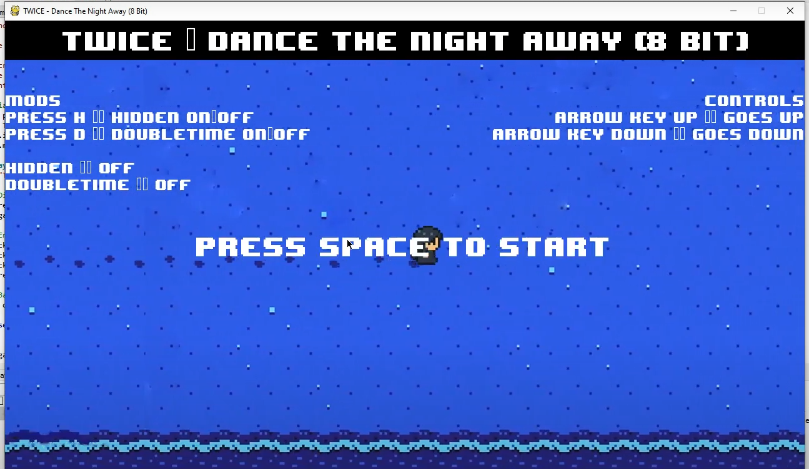
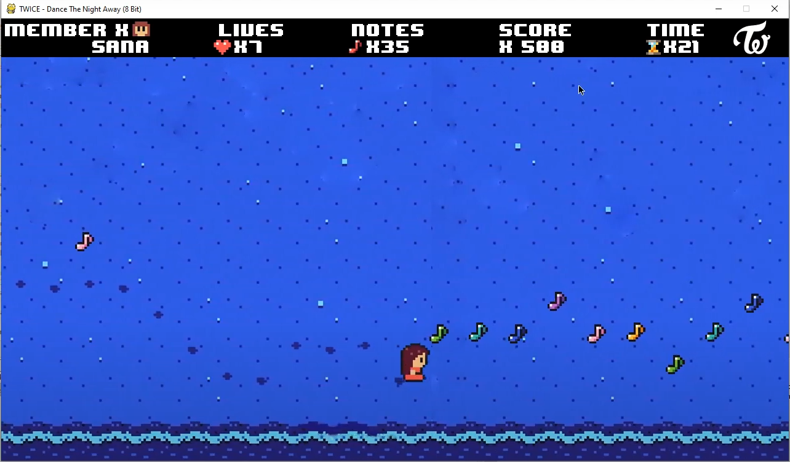

# PythonRhythmGame
This is a rhythm game made through Python using Pygame GUI as the graphical user interface. This game is inspired from a youtube video, https://www.youtube.com/watch?v=YkLaNh1F_w8&ab_channel=Darnu-Pop, and all the images along with soundtrack is credited to Darnu-Pop(yotube creator of the video). The purpose of the project was to turn the animation in the video into an actual playable game. This is how the game works: you will be playing as the TWICE members and your goal is to catch all the music notes coming your way. You will automatically keep moving forward and you can only move up and down via the up_arrow key and down_arrow key. You will begin with 9 lives, and you will lose a life each time you miss a music note and you lose when you lose all 9 lives, otherwise you win if you live this the end. The reason why this is a rhythm came comes from the fact that the position of the music notes matches the song and pitch. There are also 2 mods you can add to make the game more challenging, which is double-time(speeds up the song and game to 2x speed), and hidden(when the music note gets closer to the player, it becomes invisible), and these 2 mods are inspired from a popular rhythm game, OSU. Here is a brief demo of the game https://youtu.be/_70Ct3_WNeI, the first four minutes of the game is me explaining how the game works, and the last 3 minutes is the playthrough.

Below is the start menu screen of the game:

Below is the gameplay:

